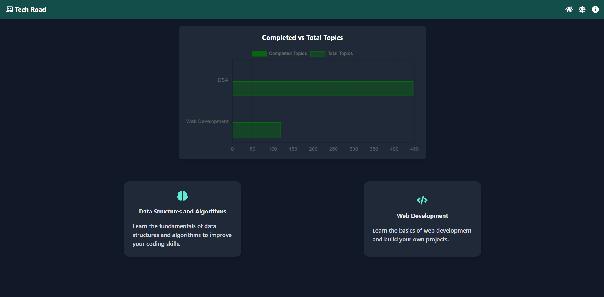
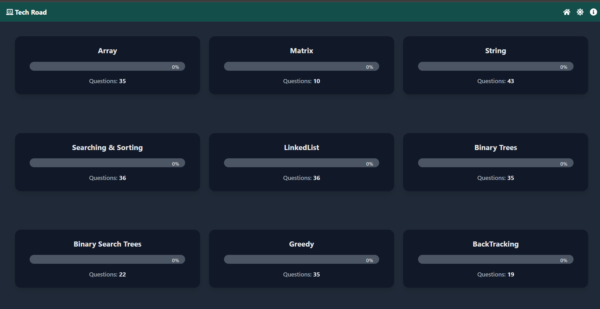
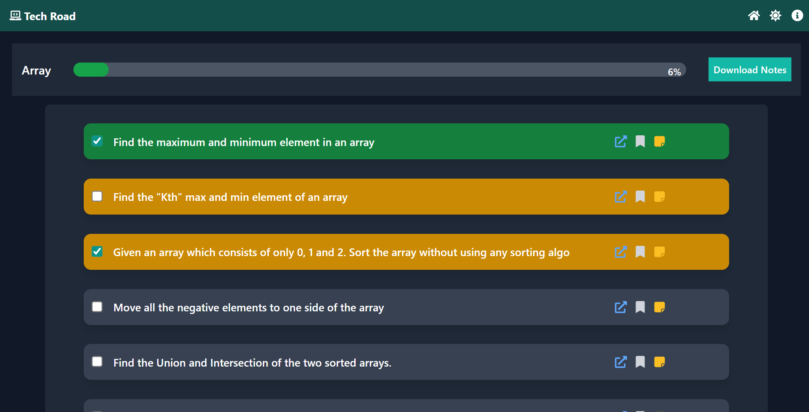
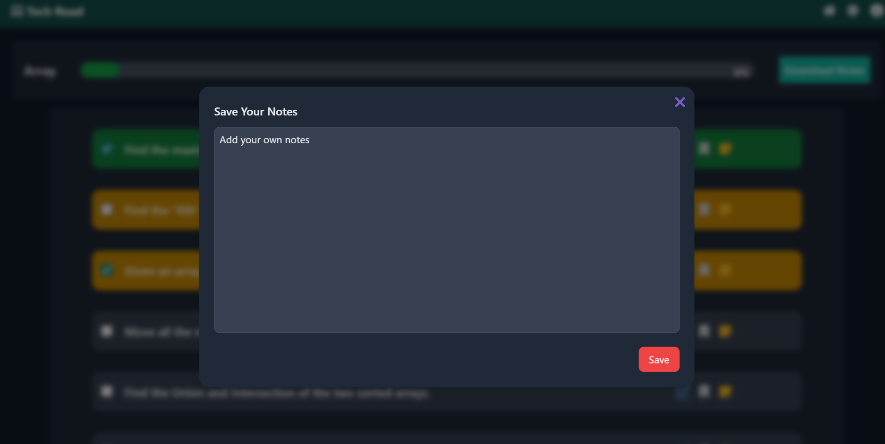
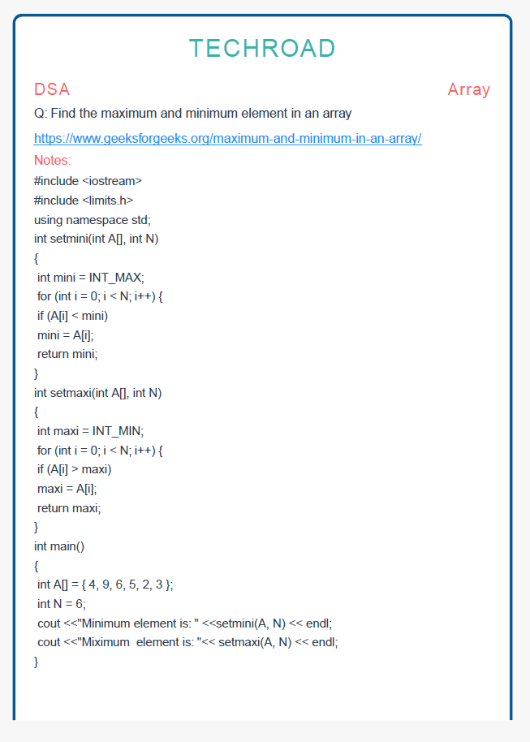

# 🚀 Roadmap Learning Tracker  

A Feature-rich roadmap-based learning platform to help students track their progress in **DSA and Web Development**.  
This project provides an interactive way to **bookmark questions, take notes, track completion, download notes as PDFs, and visualize progress** with a clean UI and **dark mode support**.  

---

## 🌟 Key Features  

✅ **Interactive Roadmaps** – Predefined DSA & Web Development paths for structured learning  
✅ **Progress Tracking** – Visual progress indicators & completion graphs  
✅ **Bookmark & Notes** – Save custom notes for each topic  
✅ **Download Notes as PDFs** – Save all notes at once for offline access  
✅ **Bar Graph Comparison** – Compare progress in DSA & Web Development  
✅ **Dark & Light Mode** – Better accessibility & user experience  

---
## 🖥 Technologies Used  

- **React.js** – Front-end framework for building interactive UIs  
- **Tailwind CSS** – Utility-first CSS framework for responsive design  
- **Chart.js** – Data visualization library for progress graphs  
- **react-pdf** – Library for generating and downloading PDF notes  

## 📸 Screenshots  

Here are some previews of the application in action:  

### **Home Page**  
  

### **Roadmap Page**  
  

### **Progress Tracking**  
  

### **Add Notes Modal**  


### **Notes PDF**  
 


## 🚀 Installation Guide  

Follow these steps to set up and run the project on your local machine.  

### **1️⃣ Clone the Repository**  
First, download the project files to your local system:  
```sh
git clone https://github.com/Jeevan-36/Tech-Road
cd Tech-Road
```

### **2️⃣ Install Dependencies**
```sh
Install the required packages using npm :
npm install
```

### **3️⃣ Start the Application**
```sh
Finally, start the application using the following command:
npm run dev
```

### **4️⃣ Open the Application**
```sh
Open your web browser and navigate to `http://localhost:3000` to access the application.
```
---

## 🛠 Future Improvements
🔄 Use Redux for State Management
\
🚀 **Add authentication** for personalized tracking  
📱 **Enhance mobile responsiveness**  
🎯 Expand roadmap options for more technologies  

---
## 🤝 Acknowledgments  

A huge thank you to **Love Babbar** & **Hitesh Choudhary** for their structured guidance in **DSA & Web Development**!  

🔗 [Love Babbar’s YouTube](https://www.youtube.com/@LoveBabbar)  
🔗 [Hitesh Choudhary’s English Channel](https://www.youtube.com/@HiteshCodeLab)  
🔗 [Hitesh Choudhary’s Hindi Channel](https://www.youtube.com/@chaiaurcode)

